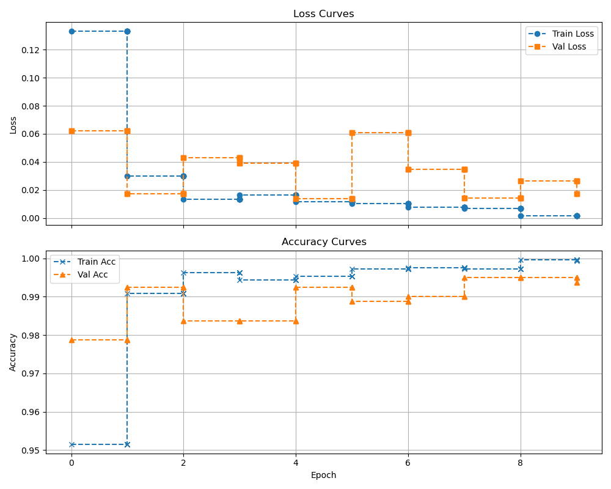
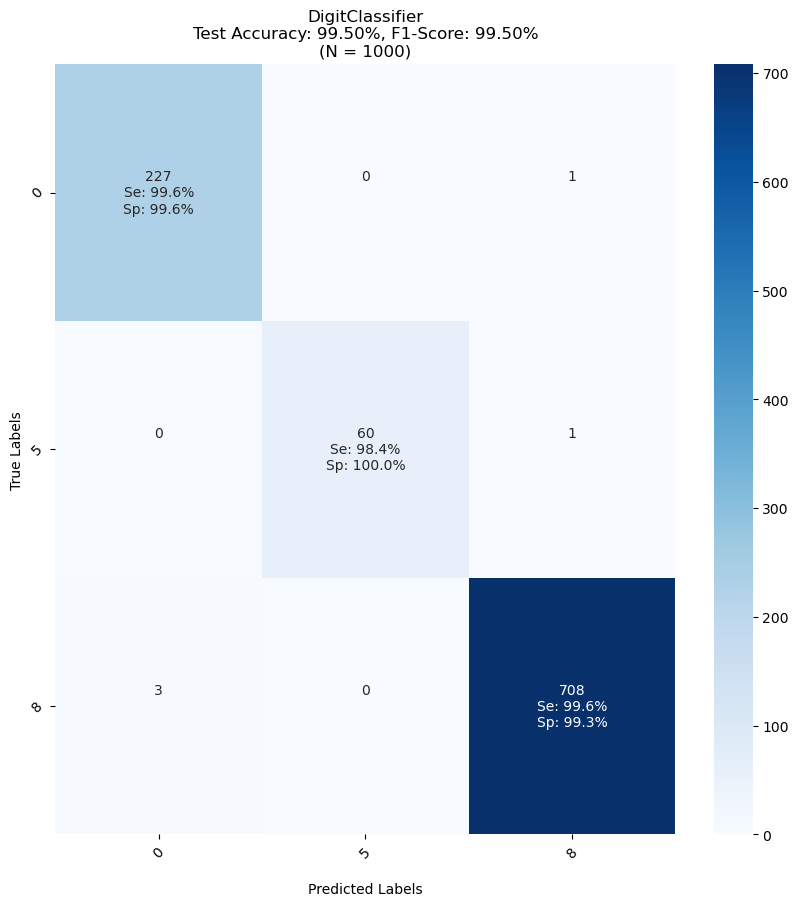

# digit_classification

git clone https://github.com/studious-broccoli/digit_classification.git

# Setup
pip install pip-tools  
pip install -e .  
pip-compile pyproject.toml --output-file=requirements.txt  

  
# To Test
pytest tests/
  

# Download data
digit-classification download-data 
--data-dir data/

# Train model
digit-classification train \
--data-dir data/  \
--output-dir checkpoints 
--epochs 20

<figure>
    
    <figcaption>Figure 1: Learning Curve Example.</figcaption>
</figure>

# Evaluate model
digit-classification evaluate \
--data-dir data/ \
--checkpoint-path checkpoints/lightning_logs/version_3/

<figure>
  
  <figcaption>Figure 2: Confusion Matrix Example.</figcaption>
</figure>

# Predict
digit-classification predict \
--checkpoint-path checkpoints/lightning_logs/version_3/ \
--input-path images/test.png

<figure>
    
    <figcaption>Figure 3: Prediction Example.</figcaption>
</figure>
  
# Example Output: PyTest
% pytest tests/  
================================================================ test session starts =================================================================  
platform darwin -- Python 3.9.19, pytest-8.3.5, pluggy-1.5.0  
rootdir: /Users/ariannapryor/Documents/studious-broccoli/digit_classification  
configfile: pyproject.toml  
plugins: anyio-4.4.0, hydra-core-1.3.2  
collected 3 items                                                                                                                                      
  
tests/test_data.py .                                                                                                                           [ 33%]  
tests/test_evaluation.py .                                                                                                                     [ 66%]  
tests/test_model.py .                                                                                                                          [100%]  
  
================================================================= 3 passed in 31.53s =================================================================  

# Data Loading Output:
Downloading data to data/...  
Download complete.  

# Train Output:
Starting training for 20 epochs...  
Number of CPU cores available: 12  
Using number of workers: 8  
MNIST Dataset Shape = torch.Size([60000, 28, 28])  
Counter({1: 6742, 7: 6265, 3: 6131, 2: 5958, 9: 5949, 0: 5923, 6: 5918, 8: 5851, 4: 5842, 5: 5421})  
Train Size: 3200, Val Size: 800, Test Size: 1000  
GPU available: False, used: False  
TPU available: False, using: 0 TPU cores  
HPU available: False, using: 0 HPUs  
[INFO] Starting training from scratch...  

  | Name           | Type                | Params | Mode 
---------------------------------------------------------------
0 | train_accuracy | MulticlassAccuracy  | 0      | train
1 | val_accuracy   | MulticlassAccuracy  | 0      | train
2 | val_recall     | MulticlassRecall    | 0      | train
3 | val_precision  | MulticlassPrecision | 0      | train
4 | model          | Sequential          | 420 K  | train
---------------------------------------------------------------
420 K     Trainable params  
0         Non-trainable params  
420 K     Total params  
1.683     Total estimated model params size (MB)  
16        Modules in train mode  
0         Modules in eval mode  
Sanity Checking DataLoader 0:   0%|                                                                                             | 0/2 [00:00<?, ?it/s]Intel MKL WARNING: Support of Intel(R) Streaming SIMD Extensions 4.2 (Intel(R) SSE4.2) enabled only processors has been deprecated. Intel oneAPI Math Kernel Library 2025.0 will require Intel(R) Advanced Vector Extensions (Intel(R) AVX) instructions.
Epoch 0: 100%|█████████████████████████████████████████████████████████████████████████████████████████████| 100/100 [00:01<00:00, 56.70it/s, v_num=7]Metric val_loss improved. New best score: 0.034                                                                                                       
Epoch 1: 100%|█████████████████████████████████████████████████████████████████████████████████████████████| 100/100 [00:01<00:00, 57.57it/s, v_num=7]Metric val_loss improved by 0.002 >= min_delta = 0.0. New best score: 0.031                                                                           
Epoch 2: 100%|█████████████████████████████████████████████████████████████████████████████████████████████| 100/100 [00:01<00:00, 58.93it/s, v_num=7]Metric val_loss improved by 0.010 >= min_delta = 0.0. New best score: 0.022                                                                           
Epoch 3: 100%|█████████████████████████████████████████████████████████████████████████████████████████████| 100/100 [00:01<00:00, 57.44it/s, v_num=7]Metric val_loss improved by 0.001 >= min_delta = 0.0. New best score: 0.021                                                                           
Epoch 4: 100%|█████████████████████████████████████████████████████████████████████████████████████████████| 100/100 [00:01<00:00, 55.80it/s, v_num=7]Metric val_loss improved by 0.005 >= min_delta = 0.0. New best score: 0.016                                                                           
Epoch 9: 100%|█████████████████████████████████████████████████████████████████████████████████████████████| 100/100 [00:01<00:00, 55.68it/s, v_num=7]Monitored metric val_loss did not improve in the last 5 records. Best score: 0.016. Signaling Trainer to stop.                                        
Epoch 9: 100%|█████████████████████████████████████████████████████████████████████████████████████████████| 100/100 [00:01<00:00, 55.46it/s, v_num=7]
[INFO] Saved learning curve to checkpoints/lightning_logs/version_7/learning_curve.png  
Training complete.  

# Evaluate Output:
Evaluating model from checkpoint checkpoints/lightning_logs/version_6/...  
Number of CPU cores available: 12  
Using number of workers: 8  
MNIST Dataset Shape = torch.Size([60000, 28, 28])  
Counter({1: 6742, 7: 6265, 3: 6131, 2: 5958, 9: 5949, 0: 5923, 6: 5918, 8: 5851, 4: 5842, 5: 5421})  
Train Size: 3200, Val Size: 800, Test Size: 1000  
 Loading checkpoint: checkpoints/lightning_logs/version_6/checkpoints/epoch=1-step=200.ckpt

 ... Test Classification Report ...
              precision    recall  f1-score   support

           0       0.98      0.99      0.99       228
           5       0.94      1.00      0.97        61
           8       1.00      0.99      0.99       711

    accuracy                           0.99      1000
   macro avg       0.97      0.99      0.98      1000
weighted avg       0.99      0.99      0.99      1000

DigitClassifier  
Test Accuracy: 99.10%, F1-Score: 99.11%  
(N = 1000)  
Saving Confusion Matrix: checkpoints/lightning_logs/version_6/confusion_matrix_test.png  
Evaluation complete.  
# Predict Output:
Making prediction on input from images/test.png...    
 Loading checkpoint: checkpoints/lightning_logs/version_6/checkpoints/epoch=1-step=200.ckpt
The predicted digit is: 8  