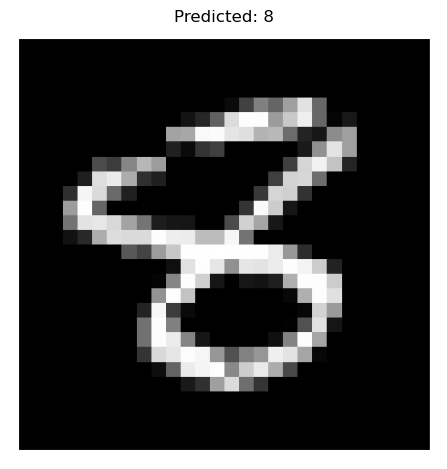

# digit_classification

git clone https://github.com/studious-broccoli/digit_classification.git

# Setup
pip install -e .
pip-compile pyproject.toml --output-file=requirements.txt

# To Test
pytest tests/

# Download data
python src/digit_classification/cli.py download-data 
--data-dir data/

# Train model
python src/digit_classification/cli.py train \
--data-dir data/  \
--output-dir checkpoints 
--epochs 20
<figure>
    
    <figcaption>Figure 1: Learning Curve Example.</figcaption>
</figure>

# Evaluate model
python src/digit_classification/cli.py evaluate \
--data-dir data/ \
--checkpoint-path checkpoints/lightning_logs/version_3/
<figure>
    
    <figcaption>Figure 2: Confusion Matrix Example.</figcaption>
</figure>

# Predict
python src/digit_classification/cli.py predict \
--checkpoint-path checkpoints/lightning_logs/version_3/ \
--input-path images/test.png
<figure>
    
    <figcaption>Figure 2: Prediction Example.</figcaption>
</figure>

